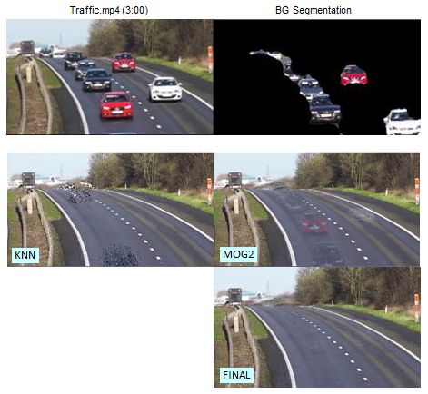
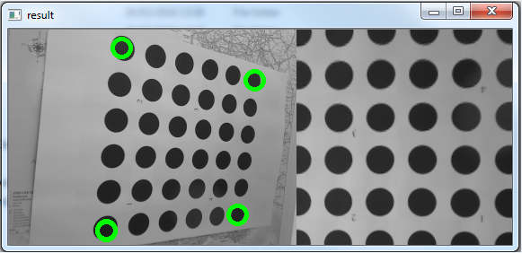
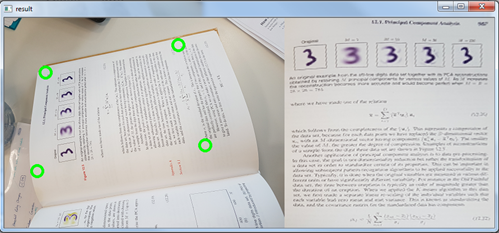
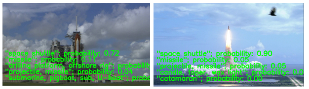
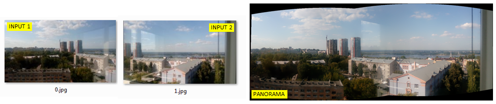

# Computer Vision
:mount_fuji:  Misc OpenCV code for working with images and video streams.

### Background Subtraction

`Background subtraction` is the removal of dynamic elements from a static
background image. In this example we have a fixed-camera video of cars
driving along a highway. We wish to isolate a single clear image of the
background.

Five segmentation algorithms are explored:

    1. KadewTraKuPong and Bowden segmentation mask
    2. Gaussian Mixture segmentation by Zoran Zuvkovic
    3. Godbeher, Matsukawa, and Goldberg
    4. Counting by Sagi Zeevi
    5. KNN Nearest Neighbors (best)

<p align="center">
  
</p>

Call the function for the selected algorithm using the following:

```
# Nearest Neighbors
fgbg = cv2.createBackgroundSubtractorKNN()
split_image_fgbg(subtractor=fgbg, open_sz=(5, 5), close_sz=(25, 25),
                 show_bg=True, show_shdw=False)
```

File [005_background_subtraction.py](005_background_subtraction.py)

</p>

### Interactive Perspective Fix

OpenCV app to recalculate perspective based on user inputs.

An image is loaded and displayed, and a `mouse_callback` event is
tracked to evaluate the coordinates of the corners. Once four corners
are selected they are passed to the `cv2.getPerspectiveTransform`
function and the images perspective is fixed. Finally, both the
original image and new image are displayed side by side.

<p align="center">
  
</p>
<p align="center">
  
</p>

File [004_img_interactive_perspective.py](004_img_interactive_perspective.py)

</p>

### Inception NN Object Detection

Deep learning models trained on the `ImageNet` database
are loaded into Caffe and used to classify images in a video stream.

Classification function for the neural network works as follows:

        1. Gets frame from video,
        2. Transform them into tensors,
        3. Forward feed into neural network,
        4. Selects the highest probability out of five categories,
        5. Add prediction to frame.

<p align="center">
  
</p>
<p></p>

Other neural nets can be loaded from the `cv2.dnn.readNetFromCaffe` method.

```

resnet_cafferesnet_  = cv2.dnn.readNetFromCaffe('../data/resnet_50.prototxt',
                                           '../data/resnet_50.caffemodel')

mean = np.load('../data/resnet_50_mean.npy')
classify('../data/shuttle.mp4', resnet_caffe, 'data', 'prob', mean, class_names)
```


File [notebooks/DL_googlenet_inception_caffe.ipynb](notebooks/DL_googlenet_inception_caffe.ipynb)

</p>

### OpenCV Panorama

A python script to create flat panoramas from images using the
`cv2.createStitcher` stitching algorithm. The method accepts an array
of images to combine, and returns a stitching result status as well
as a panorama image. A `0.25x` preview is displayed upon success.

<p align="center">
  
</p>

The main stitching method is relatively straight forward to call.

```
stitcher = cv2.createStitcher()
ret, pano = stitcher.stitch(frames)
```

But can return the following error status when the stitch fails due to
poor input frames.

    cv2.STITCHER_OK
    cv2.STITCHER_ERR_NEED_MORE_IMGS
    cv2.STITCHER_ERR_HOMOGRAPHY_EST_FAIL
    cv2.STITCHER_ERR_CAMERA_PARAMS_ADJUST_FAIL

File [006_panorama.py](006_panorama.py)

</p>
